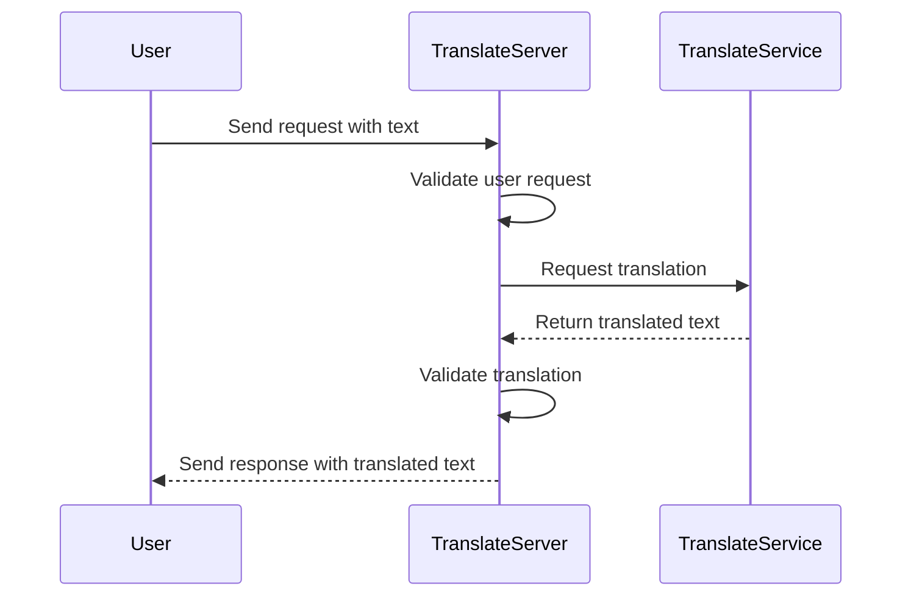

**TranslateServer** is a simple and efficient HTTP server designed for automatic translation of texts from English into Polish language. The project serves as a lightweight API that can be easily integrated with various applications, websites, or backend systems, supporting the process of localization and cross-language communication.

The core idea of the server is to act as middleware that runs the translation service and manages the accuracy and correctness of translations.



## Installation

To properly configure and run TranslateServer, you must have the following components installed:

- ***Operating system:*** native Linux (Ubuntu recommended) or Windows with WSL (Windows Subsystem for Linux)
- ***Go (programming language)*** - required for compiling and running the server
- ***(Optional) Docker*** — particularly useful on Windows for easily running the server in a container

### Install system dependencies

To use GPU hardware acceleration during translation, you **must** have an **NVIDIA graphics card with CUDA support**.
Run the installation script available in the project, which will automatically install project dependencies.
```sh
sudo ./setup.sh
```

### Go dependency configuration

After cloning the repository and before running the project, you need to configure dependencies for the Go environment. To do this, run the following command in the project's root directory:
```sh
go mod tidy
```

## Building applications

The project includes script that automates the build process:
- compiles the application into a binary form.
- runs unit tests
- generate a coverage report

To build the project, simply run (build directory will be create):
```sh
./ci-script.sh
```

### Building Docker image

To prepare a complete version of TranslateServer, especially for running on Windows, you must also create a Docker image.
Run this command on PowerShell command line:
```sh
Set-ExecutionPolicy -Scope Process -ExecutionPolicy Bypass
.\docker\build.ps1
```

The Docker image is designed to work the same as the native Linux system. You can start the application in Docker using the command:
```sh
docker run -p 5000:5000 --gpus all -v %cd%\\build\\out\\TranslateServer:/data translate_server_image:latest /data/main
```

---------------------------------------------------
# Notatki

docker run translate_server_image:latest bash -c 'echo "val=$MARIAN_INSTALL_PATH"'

run tłumacza:

echo "Jack would like buy a new car ." > input.txt
docker run --gpus all -v C:\Users\K\Desktop\TS:/data translate_server_image:latest /opt/marian-dev/bin/marian-decoder -m /opt/marian-dev/vocab/opus_bt/opus+bt.spm32k-spm32k.transformer-align.model1.npz.best-perplexity.npz -v /opt/marian-dev/vocab/opus_bt/opus+bt.spm32k-spm32k.vocab.yml /opt/marian-dev/vocab/opus_bt/opus+bt.spm32k-spm32k.vocab.yml -i /data/input.txt -o /data/output.txt

./marian-decoder -m /opt/marian-dev/vocab/opus/opus.spm32k-spm32k.transformer.model1.npz.best-perplexity.npz -v /opt/marian-dev/vocab/opus/opus.spm32k-spm32k.vocab.yml /opt/marian-dev/vocab/opus/opus.spm32k-spm32k.vocab.yml -i input.txt -o output.txt

{
echo "digraph G {"
modulePath=$(go list -m)
prefixToCut="$modulePath/internal/"
go list -f '{{.ImportPath}} {{join .Imports " "}}' ./... \
| while read pkg imports; do
if [[ $pkg == *"/mock"* ]]; then
continue
fi
shortPkg=${pkg#$prefixToCut}
for imp in $imports; do
if [[ $imp == $modulePath* && $imp != *"/mock"* ]]; then
shortImp=${imp#$prefixToCut}
echo "\"$shortPkg\" -> \"$shortImp\""
fi
done
done
echo "}"
} | dot -Tpng -o local_deps.png
